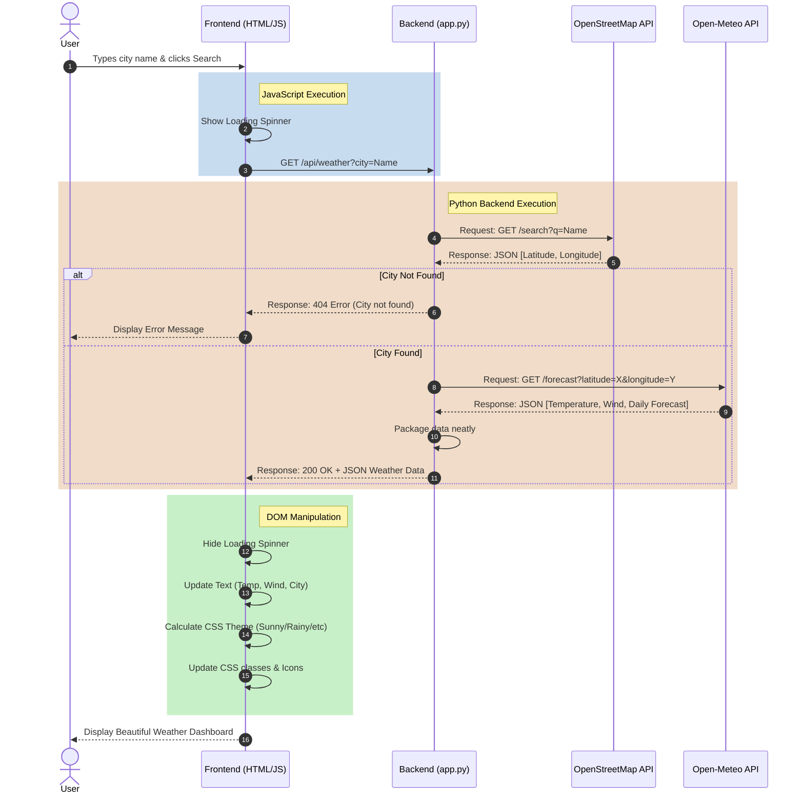

# 👋 Welcome to the AI Weather App!

Hi! I'm so glad you're checking out this project. This document is here to explain exactly how this application works behind the scenes. We'll look at the cool technologies powering it and trace the journey of a weather search from the moment you click the button to the moment it pops up on your screen.

## 🌟 What does this app do?
At its core, this is a full-stack web application. It lets you type in the name of almost any city or town in the world. It then hunts down the exact GPS coordinates for that place, grabs the real-time weather and a 5-day forecast, and displays it all on a beautifully styled dashboard that dynamically changes color based on the weather!

**The Tech Stack We Used:**
- **Frontend (What you see):** Pure Vanilla HTML, CSS (using some very cool glassmorphism effects), and JavaScript. No heavy frameworks!
- **Backend (The brain):** Python, powered by the lightweight Flask web framework.
- **Geocoding API:** OpenStreetMap Nominatim (This helps us find the coordinates for the city names).
- **Weather API:** Open-Meteo (This gives us the actual weather data for free!).

---

## 🗺️ The Journey of a Search (Code Flowchart)

Ever wonder what happens when you hit "Search"? Here is a visual map of the exact sequence of events that kicks off inside the code:

---

## 🚶‍♂️ Step-by-Step Breakdown

If you prefer reading over charts, here is the exact journey described step-by-step!

### 1. The Screen You See (`templates/index.html` & `static/css/style.css`)
When you visit `http://127.0.0.1:5000` in your browser, our Python server quickly hands over the HTML layout, the CSS styles, and the Javascript files. At first, the weather dashboard is hidden away, waiting for you to type something.

### 2. The Spark (`static/js/main.js`)
When you type a city and hit Enter, you trigger an event in our JavaScript file. 
- It hides the dashboard and spins up a loading animation so you know it's working.
- It then makes a quick background network call to our Python server, saying: *"Hey! The user wants the weather for this city!"*

### 3. Finding the Coordinates (`app.py`)
Because weather services are basically robots, they don't understand city names like "Paris"—they only understand GPS coordinates. 
- So, our Python server reaches out to the OpenStreetMap database first.
- It asks, *"Where exactly is this place?"* and OpenStreetMap kindly replies with the exact Latitude and Longitude.

### 4. Grabbing the Weather (`app.py`)
Now that Python knows the coordinates, it reaches out to the Open-Meteo API.
- It asks for the current temperature, wind speed, humidity, and the forecast for the next 5 days.
- When Open-Meteo replies with a giant wall of raw data, Python acts as a filter. It picks out only the pieces we care about, packs them neatly into a digital box (a JSON dictionary), and ships it back to your browser.

### 5. Bringing it to Life (`static/js/main.js`)
Your browser receives that neat package of weather data from Python!
- **Updating the Text:** JavaScript carefully places the new temperatures and city names into the HTML layout.
- **Changing the Vibe:** JavaScript checks if it's sunny, raining, or snowing. It strips away the old CSS theme and slaps on a new one. This triggers a smooth, animated transition of the background colors.
- **Swapping the Icons:** Finally, it updates the little weather icons to match the current conditions. And voila! The dashboard appears!

## How to Run the App
1. Open a terminal in the project directory.
2. Activate the virtual environment: `.\venv\Scripts\activate` (Windows) or `source venv/bin/activate` (Mac/Linux).
3. Run the Flask server: `python app.py`
4. Open your browser to `http://127.0.0.1:5000`.
